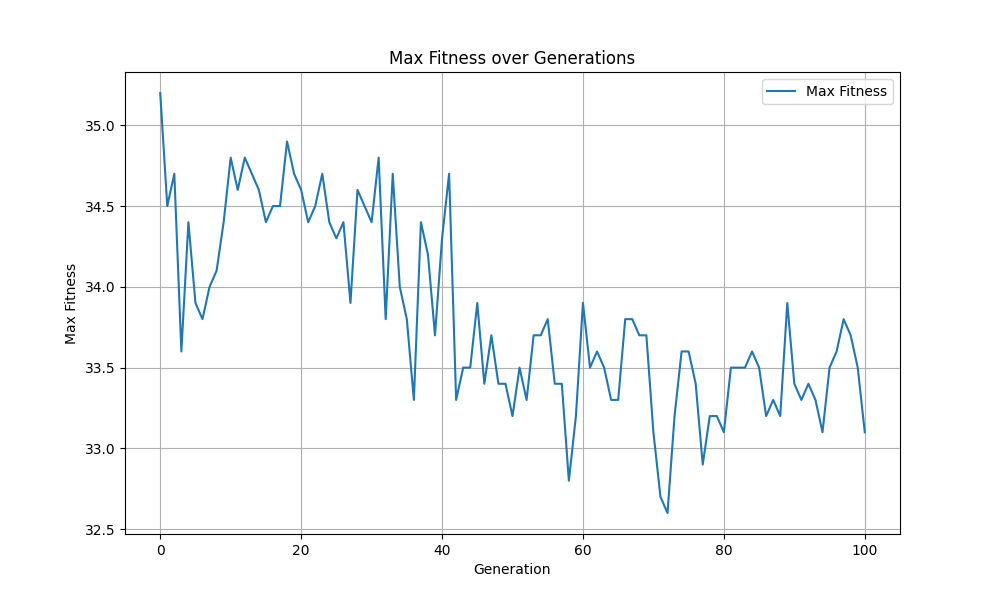

# Comparasion between Q3 and Q4
### Comparison of Results: Original vs. Modified Fitness Function

1. **Original Fitness Function (Uptrend)**:
   - The first plot shows a steady improvement in the maximum fitness over the generations. This behavior is expected for a genetic algorithm working on the OneMax problem, where the goal is to maximize the number of 1s in a sequence of bits.
   - As the generations progress, the algorithm gets better at finding solutions with more 1s, indicating that it's functioning effectively and efficiently.
    

2. **Modified Fitness Function (Downtrend)**:
   - The second plot looks very different, with a lot of fluctuations and no clear upward trend. In fact, it even trends downward, suggesting that the algorithm is struggling to make consistent progress.
   - This behavior occurs because the modified fitness values made it difficult for the algorithm to differentiate between good and bad solutions, disrupting its ability to focus on improving over generations.
    

### Key Differences
- **Clear Progress vs. Confusion**: 
  - In the original version, the algorithm made clear and consistent progress, indicating that it was effectively evolving towards better solutions.
  - In the modified version, the algorithm appeared to be confused, with fitness values fluctuating without a clear upward direction.
  - Extension research: Except max fitness values, I also calculate the mean, min fitness value and std of fitness value, we can see that the mean fitness values, are expectedly uptrend and std downtrend. This indicated the whole population is uptrend, however since throught the generations the population will converge, and the converge speed is greater than the improve speed. so we can see that the nax fitness value have downtrend  is not that confuse.
  
  
- **Selection Pressure**:
  - The changes to the fitness function reduced the differences between the fitness scores of various solutions, making it harder for the algorithm to consistently select the best individuals.

### Summary
The original fitness function enabled the algorithm to clearly identify and evolve toward the best solutions, resulting in a consistent upward trend in fitness. In contrast, the modified fitness function made it challenging for the algorithm to distinguish between individuals, causing fluctuations and a lack of steady progress in the fitness values.