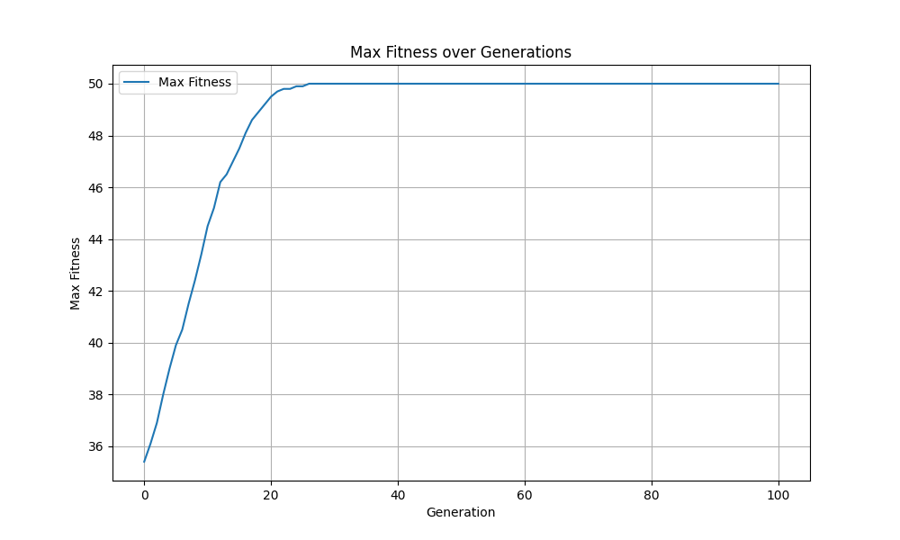
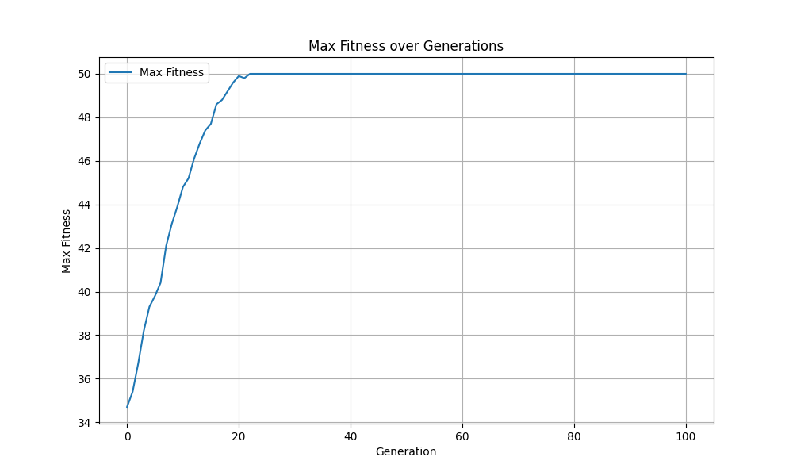

# Comparasion between Q6 and Q7
### Comparison of Results: Original vs. Modified Fitness Function (Tournament selection)

1. **Original Fitness Function (Uptrend)**:
    - The first plot shows a steady improvement in the maximum fitness over the generations. This behavior is expected for a genetic algorithm working on the OneMax problem, where the goal is to maximize the number of 1s in a sequence of bits.
    - As the generations progress, the algorithm gets better at finding solutions with more 1s, indicating that it's functioning effectively and efficiently.
    - It converges in the early generations, since using tournament selection may easily make all the polulation same, so will easily converge
     
2. **Modified Fitness Function (Uptrend)**:
    - The second plot exhibits a similar trend to the first plot, with a steady improvement in the maximum fitness over the generations. Also, converges in the early generation with the same reason.
     
    
### Key Differences

- **Fitness evaluation**: 
    - the main different of the two problem is that there fitness evaluation function. The second one is added by 1000 compare to the original one. However, the selection method we use is `tournament selection`, so the the modification of fitness function will not affect the result

### Summary
The results indicate that when using tournament selection, the convergence behavior is not significantly impacted by the modification of the fitness function, as long as the relative ranking of individuals remains the same. Both versions quickly reached high fitness values and exhibited similar trends in the plots.