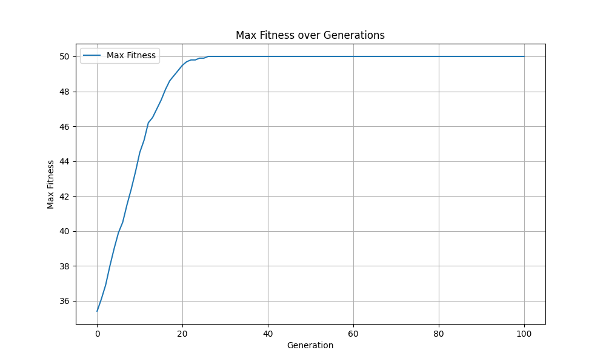

# Comparison of Fitness Over Generations: Problems 3, 4, 6, and 7

## Comparison and Analysis

| Selection Method | Fitness Function | Problem | 
| ---------------- | ---------------- | ------- | 
| Roulette Wheel   | Sum(bits)        | Q3      | 
| Roulette Wheel   | 1000 + Sum(bits) | Q4      | 
| Tournament       | Sum(bits)        | Q6      | 
| Tournament       | 1000 + Sum(bits) | Q7      | 

### Explanation
- **Roulette Wheel Selection (Q3 and Q4)**:
  - **Q3**: Using the sum of bits fitness function, the algorithm displayed a fast convergence with high stability. The final fitness value was moderate.
    
  - **Q4**: When the fitness function was changed to 1000 + sum(bits), the convergence rate slowed down, with maximun fitness value decreasing. 
    

- **Tournament Selection (Q6 and Q7)**:
  - **Q6**: With the sum of bits fitness function, tournament selection showed a quick convergence rate and the populations being the same in final. since the tournament selection. 
    
  - **Q7**: For the 1000 + sum(bits) fitness function, the algorithm had the same result with Q6, since the modification fitness function will not affect the result of tournament selection. So the totally result will not change.
    

## Conclusion
    - The results indicate that tournament selection converges faster than roulette wheel selection, but it tends to reduce the diversity of the population more quickly. This is because tournament selection favors the fittest individuals, leading to a faster but potentially more premature convergence.

    - Additionally, changing the fitness function (from sum(bits) to 1000 + sum(bits)) significantly impacted the performance of the roulette wheel selection, resulting in a different convergence rate and fitness values. However, for tournament selection, the change in the fitness function had little to no effect on the final results. This suggests that tournament selection is less sensitive to changes in the fitness function compared to roulette wheel selection, leading to consistent outcomes regardless of the fitness scaling.