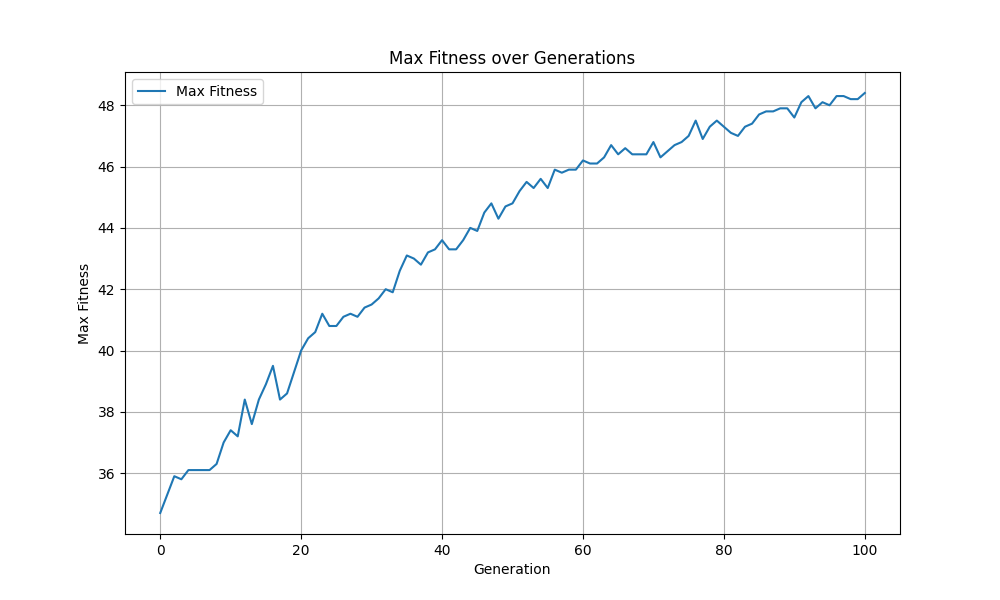
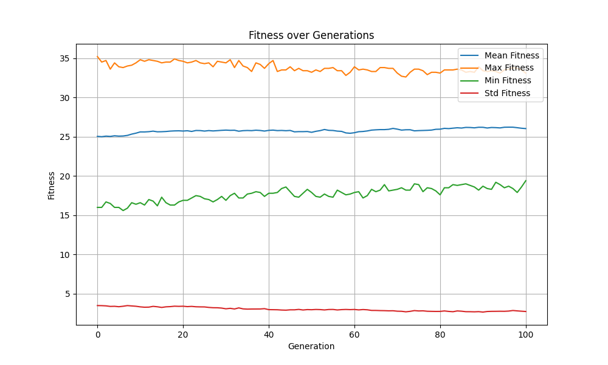
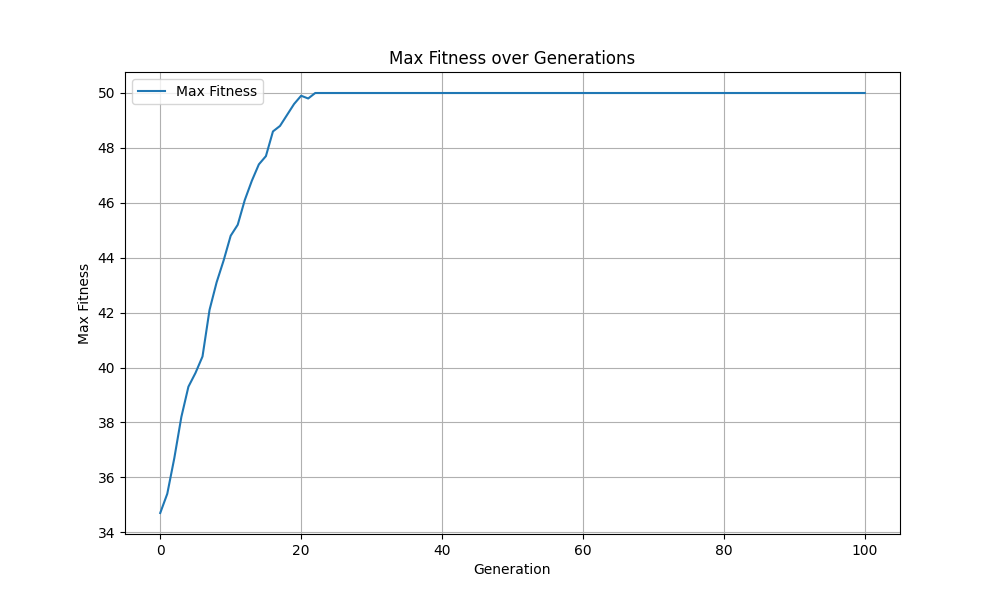

# Q1. The Eight Queens Problem

## (a) How big is the phenotype space for the eight queens problem?

The phenotype space for the eight queens problem means the number of all possible arrangements of eight queens on an 8x8 chessboard. The total number of configurations is computed by considering that each of the 8 queens must be placed on a unique row and a unique column without attacking each other.

The size of the phenotype space, which includes all potential configurations (including invalid ones), is:

64 * 63 * 62 * ... * 58 * 57 $\approx$ 1.78 * $10^{14}$ (if consider the queens are different)

64 * 63 * 62 * ... * 58 * 57 / 8! $\approx$ 4.42 * $10^{9}$ (if consider the queens are same)

However, if we consider only valid placements (where no two queens can attack each other), the count is significantly smaller. The exact number of valid solutions to the eight queens problem is **92**.

## (b) Give a genotype to encode the 8x8 chessboard configuration.

One common genotype representation for the eight queens problem is using a **permutation-based encoding**. We can represent the positions of the queens by a list of integers where the index of each element represents the row, and the value of the element represents the column position of the queen.

For example, the list:
\[ [1, 5, 8, 6, 3, 7, 2, 4] \]
would mean:
- Queen in row 1 is placed in column 1.
- Queen in row 2 is placed in column 5.
- Queen in row 3 is placed in column 8.
- Queen in row 4 is placed in column 6.
- Queen in row 5 is placed in column 3.
- Queen in row 6 is placed in column 7.
- Queen in row 7 is placed in column 2.
- Queen in row 8 is placed in column 4.

This representation ensures that no two queens are in the same row, and the specific values guarantee no two queens are in the same column.

## (c) How big is the genotype space you give in (b)?

The size of the genotype space in this permutation-based encoding is equal to the number of permutations of 8 distinct columns. Therefore, the size of the genotype space is:
8! = 40,320

This means there are 40,320 possible configurations for placing the queens on the board using this encoding.

## (d) Briefly describe why the proposed genotype is able to cover the phenotype space.

The proposed genotype is able to cover the phenotype space because it explicitly represents the positions of the queens such that no two queens are in the same row or column. This directly maps to the requirements of the eight queens problem, where each queen must be positioned uniquely on the board to avoid being attacked.

Using permutation-based encoding ensures that we only generate configurations that respect the non-attacking constraints for rows and columns. Although diagonal conflicts are not directly prevented by this representation, they can be checked and filtered easily during the evaluation process. Thus, the genotype efficiently represents all potential solutions that need to be explored to solve the problem.

# Q2. Precision caculation
To achieve precision 0.001 in the interval [0, 1].

We need at least (1-0)/0.001 = 1000 distinct values.

```
--> 2^x >= 1000
--> x >= log2(1000)
--> x >= 9.97
--> x need to greater or equal 10
```

we need at least 10 bits to represent the value with a precision of 0.001

# Q5. Comparasion between Q3 and Q4
### Comparison of Results: Original vs. Modified Fitness Function

1. **Original Fitness Function (Uptrend)**:
   - The first plot shows a steady improvement in the maximum fitness over the generations. This behavior is expected for a genetic algorithm working on the OneMax problem, where the goal is to maximize the number of 1s in a sequence of bits.
   - As the generations progress, the algorithm gets better at finding solutions with more 1s, indicating that it's functioning effectively and efficiently.
    

2. **Modified Fitness Function (Downtrend)**:
   - The second plot looks very different, with a lot of fluctuations and no clear upward trend. In fact, it even trends downward, suggesting that the algorithm is struggling to make consistent progress.
   - This behavior occurs because the modified fitness values made it difficult for the algorithm to differentiate between good and bad solutions, disrupting its ability to focus on improving over generations.
    

### Key Differences
- **Clear Progress vs. Confusion**: 
  - In the original version, the algorithm made clear and consistent progress, indicating that it was effectively evolving towards better solutions.
  - In the modified version, the algorithm appeared to be confused, with fitness values fluctuating without a clear upward direction.
  - Extension research: Except max fitness values, I also calculate the mean, min fitness value and std of fitness value, we can see that the mean fitness values, are expectedly uptrend and std downtrend. This indicated the whole population is uptrend, however since throught the generations the population will converge, and the converge speed is greater than the improve speed. so we can see that the nax fitness value have downtrend  is not that confuse.
  
  
- **Selection Pressure**:
  - The changes to the fitness function reduced the differences between the fitness scores of various solutions, making it harder for the algorithm to consistently select the best individuals.

### Summary
The original fitness function enabled the algorithm to clearly identify and evolve toward the best solutions, resulting in a consistent upward trend in fitness. In contrast, the modified fitness function made it challenging for the algorithm to distinguish between individuals, causing fluctuations and a lack of steady progress in the fitness values.
# Q8. Comparasion between Q6 and Q7
### Comparison of Results: Original vs. Modified Fitness Function (Tournament selection)

1. **Original Fitness Function (Uptrend)**:
    - The first plot shows a steady improvement in the maximum fitness over the generations. This behavior is expected for a genetic algorithm working on the OneMax problem, where the goal is to maximize the number of 1s in a sequence of bits.
    - As the generations progress, the algorithm gets better at finding solutions with more 1s, indicating that it's functioning effectively and efficiently.
    - It converges in the early generations, since using tournament selection may easily make all the polulation same, so will easily converge
     
2. **Modified Fitness Function (Uptrend)**:
    - The second plot exhibits a similar trend to the first plot, with a steady improvement in the maximum fitness over the generations. Also, converges in the early generation with the same reason.
     
    
### Key Differences

- **Fitness evaluation**: 
    - the main different of the two problem is that there fitness evaluation function. The second one is added by 1000 compare to the original one. However, the selection method we use is `tournament selection`, so the the modification of fitness function will not affect the result

### Summary
The results indicate that when using tournament selection, the convergence behavior is not significantly impacted by the modification of the fitness function, as long as the relative ranking of individuals remains the same. Both versions quickly reached high fitness values and exhibited similar trends in the plots.

# Q9. Comparison of Fitness Over Generations: Problems 3, 4, 6, and 7

## Comparison and Analysis

| Selection Method | Fitness Function | Problem | 
| ---------------- | ---------------- | ------- | 
| Roulette Wheel   | Sum(bits)        | Q3      | 
| Roulette Wheel   | 1000 + Sum(bits) | Q4      | 
| Tournament       | Sum(bits)        | Q6      | 
| Tournament       | 1000 + Sum(bits) | Q7      | 

### Explanation
- **Roulette Wheel Selection (Q3 and Q4)**:
  - **Q3**: Using the sum of bits fitness function, the algorithm displayed a fast convergence with high stability. The final fitness value was moderate.
    
  - **Q4**: When the fitness function was changed to 1000 + sum(bits), the convergence rate slowed down, with maximun fitness value decreasing. 
    

- **Tournament Selection (Q6 and Q7)**:
  - **Q6**: With the sum of bits fitness function, tournament selection showed a quick convergence rate and the populations being the same in final. since the tournament selection. 
    
  - **Q7**: For the 1000 + sum(bits) fitness function, the algorithm had the same result with Q6, since the modification fitness function will not affect the result of tournament selection. So the totally result will not change.
    


## Conclusion
    - The results indicate that tournament selection converges faster than roulette wheel selection, but it tends to reduce the diversity of the population more quickly. This is because tournament selection favors the fittest individuals, leading to a faster but potentially more premature convergence.

    - Additionally, changing the fitness function (from sum(bits) to 1000 + sum(bits)) significantly impacted the performance of the roulette wheel selection, resulting in a different convergence rate and fitness values. However, for tournament selection, the change in the fitness function had little to no effect on the final results. This suggests that tournament selection is less sensitive to changes in the fitness function compared to roulette wheel selection, leading to consistent outcomes regardless of the fitness scaling.